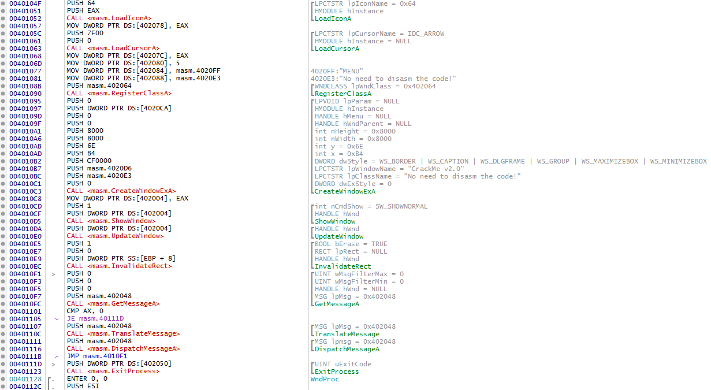
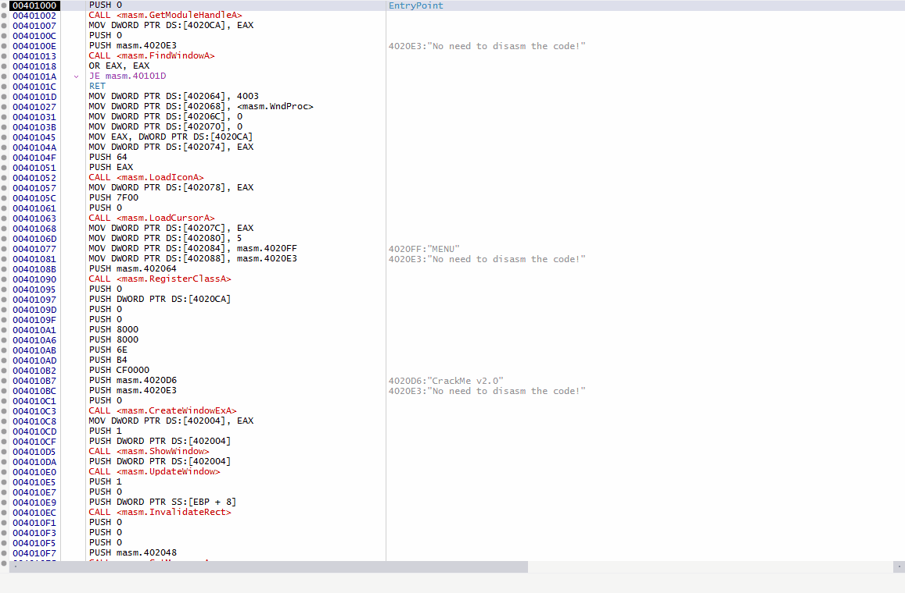
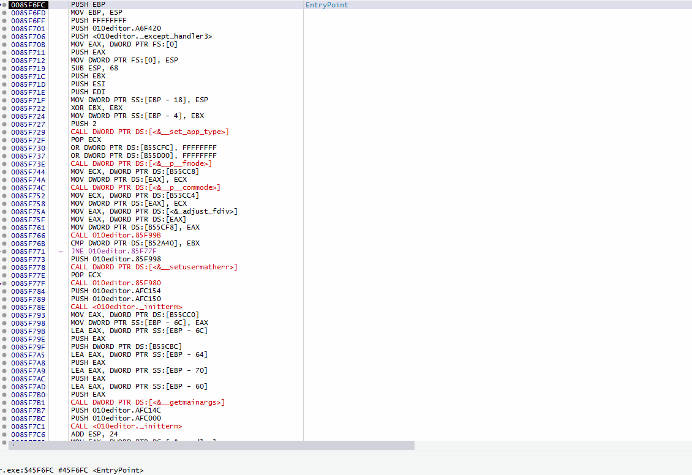

<p align="center"></p>

[](https://github.com/ThunderCls/xAnalyzer/issues)
[](https://ci.appveyor.com/project/ThunderCls/xanalyzer)
[](https://github.com/ThunderCls/xAnalyzer/releases/latest)
[](https://github.com/ThunderCls/xAnalyzer/releases/latest)
[](https://github.com/ThunderCls/xAnalyzer/releases)
[](https://github.com/ThunderCls/xAnalyzer/stargazers)
[](https://github.com/ThunderCls/xAnalyzer/blob/master/LICENSE)

**xAnalyzer** is a plugin for the x86/x64 x64dbg debugger by @mrexodia. This plugin is based on [APIInfo Plugin](https://github.com/mrfearless/APIInfo-Plugin-x86) by @mrfearless, although some improvements and additions have been made. **xAnalyzer** is capable of doing various types of analysis over the static code of the debugged application to give more extra information to the user. This plugin is going to make an extensive API functions call detections to add functions definitions, arguments and data types as well as any other complementary information, something close at what you get with OllyDbg analysis engine, in order to make it even more comprehensible to the user just before starting the debuggin task.

## Table Of Contents

- [Features](#features)
- [Download](#download)
- [Installation](#installation)
- [Configuration](#configuration)
- [Usage](#usage)
- [API Definition Files](#api-definition-files)
- [Known issues and limitations](#known-issues-and-limitations)
- [To-Do Long-Term](#to-do-long-term)
- [Version History](#version-history)
- [Contributing Guidelines](#contributing-guidelines)

## Features
Some of the main features and improvements include:

- Extended function calls analysis (over 13,000 API’s definitions from almost 200 DLL’s)

- Defined and generic functions, arguments, data types and additional debugging info recognition.

- Automatic loops detection.

- User maintained definition files

Before xAnalyzer
<p align="center"></p>

After xAnalyzer
<p align="center"></p>

## Download
Download [HERE](https://github.com/ThunderCls/xAnalyzer/releases/latest) the latest release of the binaries

## Installation
1. Download the latest version of [x64dbg](https://github.com/x64dbg/x64dbg/releases/latest)

2. Copy *xAnalyzer.dp32/xAnalyzer.dp64* files and *apis_def* folder to x32/x64 respective plugins directories of x64dbg

3. Look under the "*Plugins*" menu in the main x64dbg window or in the secondary menu in the Disasm window as well for an "*xAnalyzer*" entry

* If, after following the above steps can't see the menu entry under the "*Plugins*" menu, head to the "*Log*" tab and check for any message from the plugin that could give you an error solution hint

## Configuration
xAnalyzer has some options to choose from in order to personalize even more the experience with it, to use it just when you need it and the way you wan it. The plugin options are as follows:

- **Automatic Analysis**: When this option is ON, the plugin is going to launch a full automatic analysis over the executable code every time it reaches the entry point when loading on the debugger. By using this option you get the more closer OllyDbg initial analysis behavior on x64dbg.

- **Extended Analysis**: This option is going to force xAnalyzer to make an extended analysis over the entire code section of the debugged executable. 
*WARNING!!! By enabling this option the analysis process may take much more time and resources to complete, also larges amount of RAM memory might be used by x64dbg depending on the size of the section and the amount of extra data added to the debugged executable static disassembly*

- **Analyze Undefined Functions**: By selecting this option xAnalyzer will use generic analysis and argument types for all of those API Calls/Functions that are not defined in the api definition files and also calls like:
````
CALL {REGISTER}
CALL {REGISTER + DISPLACEMENT}
CALL {DYNAMIC_POINTER}
````

## Usage
xAnalyzer has some commands and menu options to choose from when working with an executable:

### Analyze Selection
By making a selection of several instructions in the disassembly windows of x64dbg and selecting this menu, a fast analysis will be made over the selected lines. You can also use the command *xanal selection* for launching this option or even set your own hotkeys for it in the x64dbg gui.

<p align="center"></p>

### Analyze Function
If you are in the middle of some function you could use this menu entry to analyze that entire function and only that function. Taking your single selected instruction as a reference xAnalyzer will process from there all the lines inside a block of code. You could also use the command *xanal function* for launching this type of analysis or even set your own hotkeys for it in the x64dbg gui.

<p align="center"></p>

### Analyze Module
This command it's going to launch a full analysis over the entire module. This feature takes the **Extended Analysis** option into consideration for the depth of analysis to be used. You could use the command *xanal module* to execute it as well or even set your own hotkeys for it in the x64dbg gui.

### Remove Analysis Menus
In these cases, all of these menus are going to make the opposite of what the previous commands did. In case you want to get rid of the analysis extra information in some parts of the code or in the entire executable if wished. You could also use the commands: *xanalremove selection/function/module*

## API Definition Files
xAnalyzer has an expandable system of API definition files, these files are present in the folders *"api_def"* and *"api_def/headers"* which should contain all the files with a .ini structure and with the norm of:

- "*filename*": This is the name of the module on which the API function is located in.

- "*filename.h*": This is the header containing type data (flags and enums) related information

- "*.api*" extension: Specifies that it is a definition file, no other extension will be recognized (kernel32.api, shell32.api, etc)

All these ini files contain important information for the plugin such as, the functions prototypes, argument types, etc. All of this information is used by xAnalyzer in order the set the extra information on the static code. A single entry in any of these files would be like:

**File user32.api**
````
[MessageBox]
1=HANDLE hWnd
2=LPCTSTR lpText
3=LPCTSTR lpCaption
4=[MessageBoxType] uType
ParamCount=4
Header=shell.h.api;
@=MessageBox
````

**File shell.h.api**
````
[MessageBoxType]
TypeDisplay=UINT
Base=UINT
Type=Flag
Const1=MB_ABORTRETRYIGNORE
Value1=0x00000002
Const2=MB_CANCELTRYCONTINUE
Value2=0x00000006
Const3=MB_HELP
Value3=0x00004000
Const4=MB_OK
Value4=0x00000000
Const5=MB_OKCANCEL
...
````

Any argument between brackets means that this is an specific data type (enum or binary flags) and that this will be defined in the proper .h header file specified in the key "*Header*". 

As for the header file the scheme is pretty much the same just a couple of keys there, like "*TypeDisplay*". This specify the proper data type to display in the dbg comment, then it comes "*Base*", and it will point to the base data type used by the main entry, in case there´s a linked data type, this could be between brackets as well. "*Type*" key is the type of data structure this is and it can be "Flag" or "Enum". Finally all the variable names and values come along.

If you find that a certain API call definition is not being detected or not detected correctly by xAnalyzer it might mean that it's not present in the definition files or that it is defined incorrectly, so in this case an addition or modification could be made to include any missing function or arguments as long as the same structure is followed it may be 100% customizable.

## Known issues and limitations

- First undefined call with generic arguments in a function will not be processed, unless it's preceded by a jump, since there's no way to tell how many arguments to use without illegaly using the function prolog instructions. Only docummented calls will be processed at the begining of a function or an undefined function that has been presided by a jump.

- Some "uncommon" functions have arguments among jumps, so according to the actual desgin of the plugin (no jumps among functions arguments) these calls won't be processed, since each time a jump is found the instructions in the stack are cleaned.

- Nested calls will work correctly only when:
  
  1-) Inner call is defined<br/>
  2-) If inner undefined call takes no more arguments of the stack than the arguments needed by the outter call


- It only detects loops inside functions (function boundaries Prologs/RETs). If a function contains a RET in the middle of its code it will be detected as a function end and the loops stack is cleared.

- Analysis could fail if the executable being debugged has multiple dots in its name

- Incorrect loop detection for a section with an non-conditional jump inside it (See [#7](https://github.com/ThunderCls/xAnalyzer/issues/7))

- Nested argument lines (xAnalyzer has support for nested arguments but x64dbg at the moment doesn't)

## To-Do Long-Term

- Add entropy analysis

- Flow analysis scanning instead of linear (trace emulation)

- Case-Switch detection

## Version History

***xAnalyzer 2.5.4***<br/>
*- Updated project to VS2017*<br/>
*- Fixed issues when processing argument instructions involving the stack pointer (x64 version).*<br/>
*- Fixed incorrect arguments order involving the stack pointer (x64 version).*<br/>
*- Fixed bug on undefined functions' arguments recognition that duplicated registers as different arguments (x64 version)*<br/>
*- Changed undefined call args recognition, it will only predict up to 4 undefined args by default (x86 version)*<br/>
*- Some code refactoring*<br/>

***xAnalyzer 2.5.3***<br/>
*-Detection of function names in newer versions of x64dbg fixed*<br/>

***xAnalyzer 2.5.2***<br/>
*-Used current selected disasm line for module analysis instead of cip*<br/>
*-Modified some typing in plugin entries*<br/>
*-Some code refactoring*<br/>
*-Modified command "xanal/xanalremove exe" to "xanal/xanalremove module"*<br/>

***xAnalyzer 2.5.1***<br/>
*-Fixed crash on mov instructions variations*<br/>

***xAnalyzer 2.5.0***<br/>
*-Removed [EBP+/-] instructions as possible function caller arguments*<br/>
*-Removed prefix "0x" of all function arguments values since hexadecimal is inferred*<br/>
*-Fixed arguments where pointer variables wouldn't show correctly as pointers but as base data type instead*<br/>
*-Added recognition of stack pointer usage (ESP) as possible argument for function calls (x86)*<br/>
*-Added use of accurate data type name in arguments instead of generic/base data type name*<br/>
*-Added function smart tracking feature (Smart prediction and recognition of indirect function calls like: CALL {REGISTER}, CALL {POINTER})*<br/>
*-Added name of function pointers as parameters (the entire function name, if detected, will be used instead of just the address)*<br/>

***xAnalyzer 2.4.3***<br/>
*- Added recognition of MOV instructions on x86*<br/>
*- Added recognition of functions with "Stub" suffix*<br/>
*- Fixed bug on "auto analysis" (added more EP check conditions)*<br/>
*- Clear Auto Comments/Auto Labels options checked now by default*<br/>

***xAnalyzer 2.4.2***<br/>
*- Fixed BoF when argument flags comment overpassed MAX_COMMENT_SIZE*<br/>
*- Fixed function name search bug when definition lies in a second .api file*<br/>

***xAnalyzer 2.4.1***<br/>
*- Added a new hotkeys scheme*<br/>
*- Added new options to control which previous analysis data should be erased. (This gives the possibility to work seamlessly with map loader plugins like SwissArmyKnife, etc).*<br/>
*- Added new commands (old ones have been deprecated)*<br/>
  *xanal selection : Performs a selection analysis*<br/>
  *xanal function : Performs a function analysis*<br/>
  *xanal exe : Performs an entire executable analysis*<br/>
  *xanalremove selection : Removes a previous selection analysis*<br/>
  *xanalremove function : Removes a previous function analysis*<br/>
  *xanalremove exe : Removes a previous entire executable analysis*<br/>
  *xanal help : Brings up to the log window some help text*<br/>
*- Fixed automatic analysis not launching on startup (Closes #18 )*<br/>
*- Fixed various api definition files (Closes #17 )*<br/>

***xAnalyzer 2.4***<br/>
*- New and improved API definition files with a slightly modified scheme (13,000 API’s from almost 200 DLL’s)*<br/>
*- Symbols recognition system for each API definition argument used (1000+ enums data types and 800+ flags)*<br/>
*- Recognition of params data types (BOOL, NUMERIC, NON-NUMERIC)*<br/>
*- VB "DllFunctionCall" stubs detection*<br/>
*- Strings passed as arguments are cleaner now (debugger comments now have the address part stripped)*<br/>
*- Execution Summary added to log window*<br/>
*- Hotkeys feature removed (will be incorporated in future revisions) due some conflicting with x64dbg*<br/>
*- Various bugs fixed*<br/>

***xAnalyzer 2.3.1***<br/>
*- Fixed bug when launching "Analyze Selection" menu with a single line selected, what caused an abrupt dbg exception (thanks to @blaquee)*<br/>
*- Check if the definition files folder "apis_def" and definition files exist inside it before loading the plugin*<br/>
*- Changed hot keys to Ctrl+Shift+X for selection and Ctrl+X for functions*<br/>

***xAnalyzer 2.3***<br/>
*- Added option "Analyze undefined functions". (OFF by default, anything that's not in definition files is not analyzed)*<br/>
*- Added option "Automatic analysis" (OFF by default, make analysis on launch at EP of debugged executable)*<br/>
*- Added feature "Analyze Selection" (Makes a selected instructions analysis, it supports multiple selected calls)*<br/>
*- Added feature "Analyze Function" (Makes an automatic discovery and analysis of the current function from the selected address)*<br/>
*- Added feature "Remove Analysis" from Selection/Function/Executable*<br/>
*- Added command shortcuts*<br/>
*- Added new icons*<br/>
*- Added saving configuration to .ini file*<br/>
*- Added capitalization of hexadecimal argument values*<br/>
*- Restructured feature "Analyze Executable" (Makes a full analysis of the current executable)*<br/>
*- Restructured menus*<br/>
*- New about dialog now shows the version number to keep track of updates*<br/>
*- Some small bug fixes*<br/>
*- Fixed and merged some API definition files*<br/>
*- Speed and stability improvements*<br/>

***xAnalyzer 2.2***<br/>
*- Added analysis progress indicator*<br/>
*- Added new analysis depth mode*<br/>
*-Now automatic analysis is only executed if no backup database is present*<br/>
*- Bugs fixed*<br/>

***xAnalyzer 2.1***<br/>
*- Generic arguments for undefined functions and internal subs*<br/>
*- Smart function comments and arguments (only functions with arguments on stack are being processed). This allows xAnalyzer to give a cleaner sight of the code by just processing and commenting those functions with actual arguments*<br/>
*- Detection of indirect function calls with scheme CALL -> DYNAMIC_MEMORY -> API*<br/>
*- Detection of indirect function calls with scheme CALL -> REGISTER/REGISTER + DISPLACEMENT -> API*<br/>
*- Detection of indirect function calls with scheme CALL -> JMP -> JMP -> API*<br/>
*- Automatic loops detection*<br/>
*- Fixed minors bugs*<br/>
*- Code rearrangements*<br/>

***xAnalyzer 2.0***<br/>
*- Support for x64 bits*<br/>
*- Support API call arguments order changes in x64 bits*<br/>
*- Support PDB files extra info in API calls*<br/>
*- Support of direct/indirect API calls*<br/>
*- Support of static API functions calls to main module code*<br/>
*- Fixed several wrong API calls arguments order in definition files. More calls can now be detected and commented properly*<br/>
*- Some improvements and better written code*<br/>
*- Various bugs solved*<br/>

***xAnalyzer 1.2***<br/>
*- Updated the API's definition files*<br/>
*- Added support to vc6+ executables*<br/>

***xAnalyzer 1.1***<br/>
*- Fixed issue that didn't show API's info on VC++ executables due to not properly cleaning BASIC_INSTRUCTION_INFO structures before/after using them in a loop*<br/>
*- Added/Updated the API's definition files*<br/>
*- Bugs fixed*<br/>

***xAnalyzer 1.0***<br/>
*- Initial Release*

## Contributing Guidelines

Contributions of all kinds are welcome, not only as PR but also as bugs reporting, documentation, etc.

Please keep the following in mind:

- **Bug Reports**:  Make sure you're running the latest versions of the plugin and x64dbg, also make sure you have no other plugins loaded but xAnalyzer plugin. If the issue(s) still persist: please open a clearly documented issue with a clear title and as much information as possible in order to replicate the issue and give it solution.

Thanks for using xAnalyzer plugin...and Happy Reversing to All!
